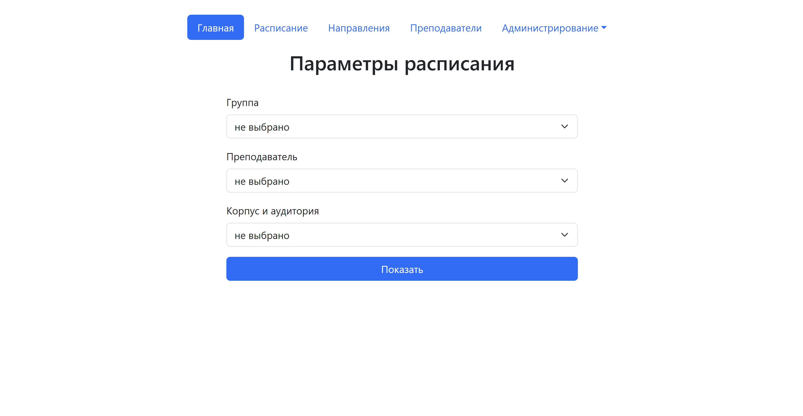
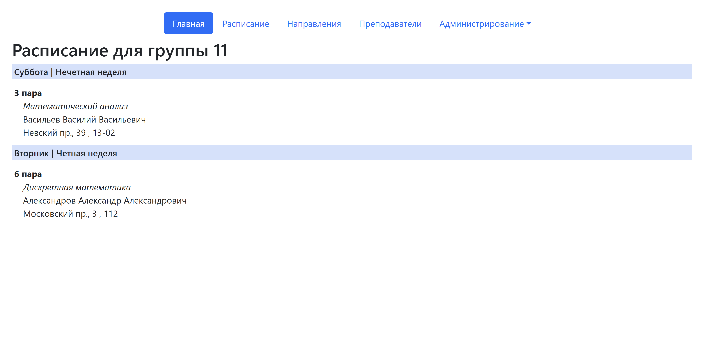
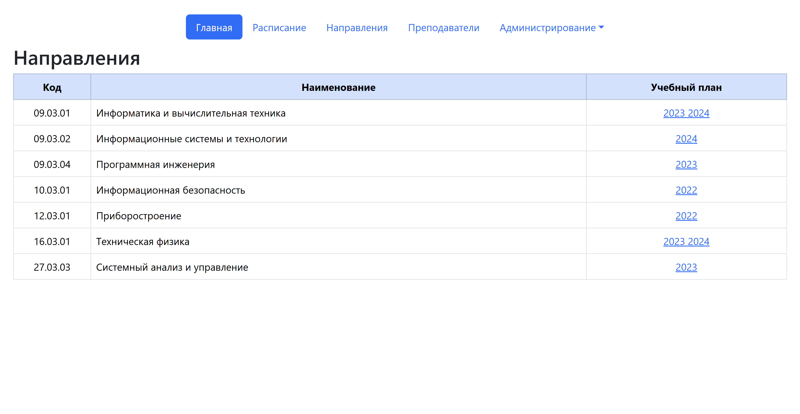
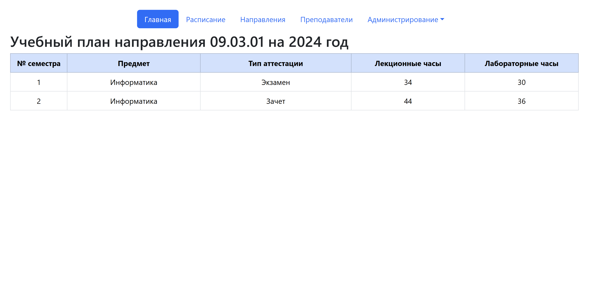
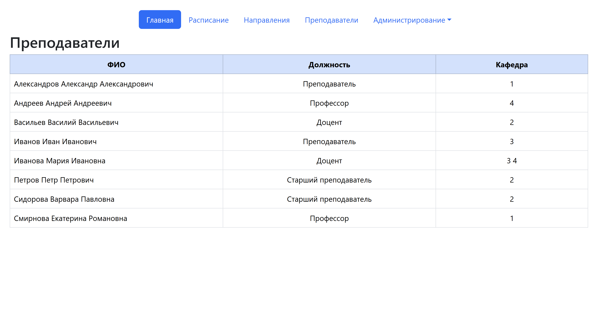
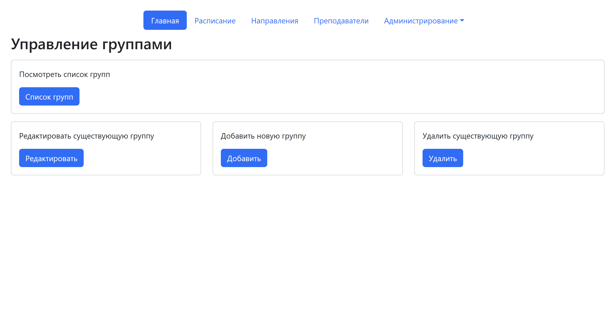

# Веб-приложение "ВУЗ: учебный план и расписание"
Веб-приложение для просмотра и управления расписанием и учебным планом.

## Стек
* Backend: Python, Flask, PostgreSQL
* Frontend: HTML, Bootstrap

## Функционал
Система содержит информацию о направлениях, группах, преподавателях и учебном плане.
### Роли пользователей
1. Анонимный пользователь
* просмотр расписания групп, преподавателей и аудиторий

* просмотр направлений и учебных планов

* просмотр списка преподавателей с указанием кафедры и должности

2. Администратор
* весь функционал анонимного пользователя  
* просмотр списка групп
* изменение учебного плана, расписания и информации о преподавателях и группах

## Структура проекта
    /
    ├─ app/
    │  ├─ templates/    # шаблоны
    │  │  ├─ ...
    │  ├─ __init__.py
    │  ├─ admin.py
    │  ├─ ...           # представления
    ├─ db/
    │  ├─ fill.sql
    │  ├─ generate.sql    
    ├─ doc/
    │  ├─ erd.drawio
    │  ├─ explanatory_note.pdf
    │  ├─ relational.drawio
    │  ├─ technical_specification.pdf
    │  ├─ use-case.drawio
    ├─ .gitignore
    ├─ README.md
    ├─ main.py
    ├─ requirements.txt
    ├─ requirements-render.txt
    ├─ start.bat
